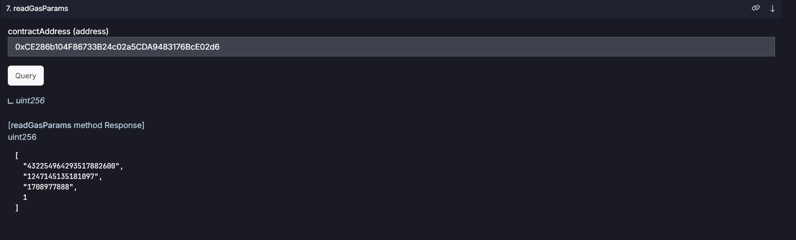
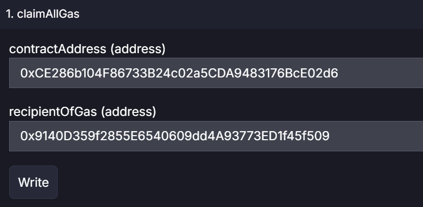

# Overview

This document outlines the available functions for settings and interactions by authorized addresses with contracts.

## Settings and Interactions with Blast Features

### Claim Gas & Native yeild
When a contract is deployed, if it is set to collect gas, an authorized address is assigned. For the test network, this is `Fenix Deployer`.
- The authority to manage native yield and gas claims can be transfer to another address.

#### Blast Interface

The contract from the Blast network offers the following functionalities for configuration changes:

- `configureGovernorOnBehalf(address _newGovernor, address contractAddress)` - Transfers management rights over a specific contract.
- `configureVoidGasOnBehalf(address contractAddress)` - Activates Void mode for gas on the contract.
- `configureClaimableGasOnBehalf(address contractAddress)` - Activates Claimable mode for gas on the contract.
- `configureVoidYieldOnBehalf(address contractAddress)` - Activates Void mode for ETH yield on the contract.
- `configureAutomaticYieldOnBehalf(address contractAddress)` - Activates Automatic mode for ETH yield on the contract.
- `configureContract(address contractAddress, YieldMode _yield, GasMode gasMode, address governor)` - A combined method to set all necessary parameters at once.

Methods for claiming gas and ETH yield from the contract (see https://docs.blast.io/building/guides/gas-fees):

- `claimYield(address contractAddress, address recipientOfYield, uint256 amount)` - Claims yield.
- `claimAllYield(address contractAddress, address recipientOfYield)` - Claims all yield.
- `claimAllGas(address contractAddress, address recipientOfGas)` - Claims all gas.
- `claimGasAtMinClaimRate(address contractAddress, address recipientOfGas, uint256 minClaimRateBips)` - Claims gas at a minimum claim rate.
- `claimMaxGas(address contractAddress, address recipientOfGas)` - Claims the maximum amount of gas.
- `claimGas(address contractAddress, address recipientOfGas, uint256 gasToClaim, uint256 gasSecondsToConsume)` - Claims a specified amount of gas.

Auxiliary methods for reading the current state:

- `readClaimableYield(address contractAddress)` - Reads the amount of claimable yield.
- `readYieldConfiguration(address contractAddress)` - Reads the yield configuration.
- `readGasParams(address contractAddress)` - Returns parameters related to gas, including ether seconds, ether balance, last updated time, and gas mode.

#### Examples

##### Claim Gas from Fenix Token Contract

- Test network address: `0xCE286b104F86733B24c02a5CDA9483176BcE02d6`
- Authorized address upon deployment: `0x9140D359f2855E6540609dd4A93773ED1f45f509`

To claim gas, you can interact through `testnet.blastscan.io` or use a script in the contract repository.

###### Using the Blast Testnet Website

1. Navigate to the Blast contract on the test network: [Blast Testnet Contract](https://testnet.blastscan.io/address/0x4300000000000000000000000000000000000002/contract/168587773/readContract)
2. In the "Read Contract" section, check the available gas for withdrawal.

3. In the "Write Contract" section, execute the withdrawal of all accumulated gas from the contract.

4. After the transaction is sent and processed, the accumulated ETH from gas will be transferred to the specified recipient's balance.

### Claim USDB/WETH yield from v2/v3 pairs
To support interactions and operations with USDB/WETH pairs, v2 pairs and v3 pools provide a set of methods through which an authorized address can configure and claim regarding rebasing tokens from the Blast system.

#### Rebasing Tokens Interface

The contract Pair (v2), AlgebraPool (v3)offers the following functionalities for configuration changes:

- `configure(address erc20Rebasing_, YieldMode mode_) ` - Configures the rebasing parameters of a specified ERC20 rebasing token in pair/pool

- `claim(address erc20Rebasing_, address recipient_, uint256 amount_)` - Claims rebasing tokens on behalf of the caller and transfers them to a specified recipient


#### Example
#### Setting Claimable Mode for WETH Token in v3 Pool

To set the rebasing token (for example, WETH) to Claimable mode in a v3 pool, follow these steps:

1. Determine the ERC20 rebasing token address for WETH that you want to configure.
2. Choose the `YieldMode` as `Claimable` for the token.
3. Use the `configure` function of the `AlgebraPool` (v3) contract, passing in the WETH token address and the desired `YieldMode`.
4. Execute the transaction, ensuring you have the necessary permissions to perform this action.

##### Claiming Accumulated WETH Yield in v3 Pool

To claim accumulated WETH yield from a v3 pool:

1. Identify the ERC20 rebasing token address for WETH from which you want to claim yield.
2. Specify the recipient address where the claimed WETH tokens should be transferred.
3. Determine the amount of WETH yield you wish to claim.
4. Use the `claim` function of the `AlgebraPool` (v3) contract, providing the WETH token address, recipient address, and the amount of yield to claim.
5. Execute the transaction with the necessary permissions to claim the yield.

## Configuration Instructions for DEX v2/v3 Pairs/Pools

### V2
In the case of v2, it is provided that the authorised address can set the following settings These methods are called on the PairFactoryUpgradeable address (v2 pair factory)

- `MAX_FEE`: Maximum fee limit set at 5% (500 based on the conversion rate).
- `PRECISION`: Represents 100% and is set at 10,000.


To calculate the fee you want to set, use the conversion below:
- 100% = 10,000
- 50% = 5,000
- 1% = 100
- 0.1% = 10
- 0.01% = 1

#### Default Fee for Volatility/Stable Pairs

To set the default trading fee for either volatile or stable pairs, use the `setFee` function. This function allows you to specify different fees for stable and volatile pairs.
```js
    function setFee(bool _stable, uint256 _fee)
```
* `_stable`: A boolean value indicating whether the pair is considered stable (true) or volatile (false).
* `_fee`: The fee amount to be set. This value should be within the allowed range. (0.01% - 5%) 


#### Custom fee
To set a custom trading fee for a specific pair, use the `setCustomFee` function. This allows for greater flexibility in fee structures across different pairs.
```js
function setCustomFee(address _pair, uint256 _fee)
```
* `_pair`: The address of the pair for which the custom fee is to be set.
* `_fee`: The custom fee amount. Ensure this is within the maximum fee limit. (0.01% - 5%)

#### Default protocol fee 
Protocol fee is the value of the distribution between lp providers and FeesVault, by default it is 100% (sending the all swap fee to FeesVault)
```js
function setProtocolFee(uint256 _newFee)
```
`_newFee`: The new protocol fee to be set. It must not exceed the precision limit. **(0% - 100%)**


#### Custom protocol fee
```js
function setCustomProtocolFee(address _pair, uint256 _newFee) external
```
`_pair`: The address of the pair for which the custom protocol fee is to be set.
`_newFee`: The custom protocol fee amount. It must be within the precision limit. **(0% - 100%)**


### V3
The fee setting for v3 fully aligns with the approach used by Algebra https://docs.algebra.finance/algebra-integral-documentation/overview-faq/what-is-algebra

## Emergency functions
The protocol includes several emergency functions designed to protect the system and its users in extraordinary circumstances:

### Dex v2 
For Dex v2, an authorized address has the capability to pause all swaps across all pairs
* `setPause(bool _state)` - this method on the PairFactory is used to set a pause on all pairs of this factory. It can only be called by an authorized address.

### Dex v3
In Dex v3, stopping actions in a pool is achieved by replacing the connected standard plugin with an AlgebraStubPlugin. Enabling the stop action mode in pairs is complex and cannot be executed by a simple method.

### Gauges
For each gauge, there is an option to activate an emergency mode, which stops deposits into the gauge and allows users to withdraw their funds through an emergency withdrawal process:
* `activateEmergencyMode()` - Enables emergency mode on a gauge.
* `stopEmergencyMode()` - Disables emergency mode on a gauge.