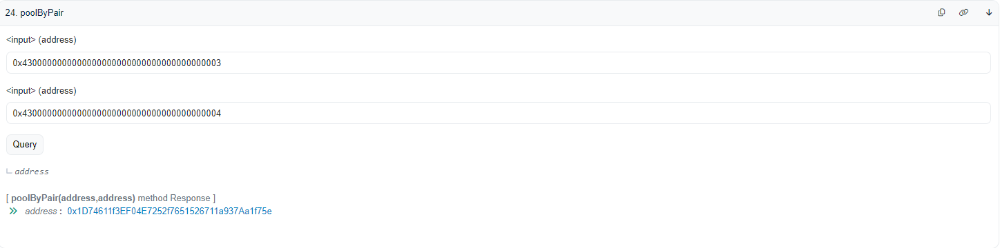
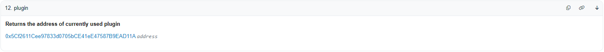
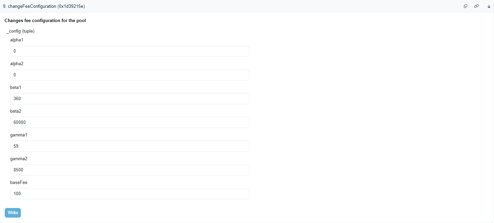

# Managing Algebra Pool Fees

This guide provides instructions for setting and managing swap fees in Algebra pools. It covers setting the default fee for new pools, configuring dynamic fees, and changing fees for exists individual pools.

## Overview

Algebra pools support both static and dynamic swap fee configurations. This documentation will guide you through:

1. Setting the default swap fee for all new pools.
2. Setting the default dynamic swap fee configuration for all new pools.
3. Changing the swap fee for a specific pool when dynamic swap fee is not enabled.
4. Changing the dynamic swap fee configuration for a specific pool when dynamic fee is enabled.

**!!!! IMPORTANT:**
1. **Dynamic fee enabled by default**
2. **Changing the swap fee by default will not change the swap fees percentage in existing pools**

## Prerequisites

Ensure you have access to the following contracts:
- `AlgebraFactory` [Link to explorer](https://blastscan.io/address/0x7a44CD060afC1B6F4c80A2B9b37f4473E74E25Df)
- `BasePluginV1Factory` [Link to explorer ](https://blastscan.io/address/0x118A7D61bd36215a01Ab8A29Eb1e5b830c32FA23)

## 1. Setting the Default Fee for All New Pools

To set the default fee for all new pools, use the `setDefaultFee` function in the `AlgebraFactory` contract. This fee will apply to any new pools created.

### Method: setDefaultFee
For detailed documentation, refer to the [AlgebraFactory documentation](https://docs.algebra.finance/algebra-integral-documentation/algebra-integral-technical-reference/integration-process/specification-and-api-of-contracts/algebra-factory#setdefaultfee).
### Signature
```solidity
  /// @dev updates default fee for new pools
  /// @param newDefaultFee The new  fee, _must_ be <= MAX_DEFAULT_FEE
  function setDefaultFee(uint16 newDefaultFee) external;
```
### Instructions
1. Ensure you are the owner of the AlgebraFactory contract.
2. Call the `setDefaultFee` function with the desired fee value (in hundredths of a bip). For a 3% fee, the value should be `30000`.
    1. 5% = 5e4 = 50,000
    2. 0.01% = 0.01e4 = 100

### Example
```solidity
AlgebraFactory.setDefaultFee(30000);
```

## 2. Setting the Default Dynamic Fee Configuration for All New Pools

To set the default dynamic fee configuration, use the `changeFeeConfiguration` function in the `BasePluginV1Factory` contract. This configuration will apply to any new pools that have dynamic fee enabled.

### Method: changeFeeConfiguration
For detailed documentation, refer to the [Adaptive Fee documentation](https://docs.algebra.finance/algebra-integral-documentation/algebra-v1-technical-reference/contracts/adaptive-fee/how-to-tweak-formula-behaviour).

### Instructions
1. Ensure you have the appropriate permissions (either the pluginFactory or ALGEBRA_BASE_PLUGIN_MANAGER role).
2. Prepare the `AlgebraFeeConfiguration` struct with the desired configuration.
3. Call the `changeFeeConfiguration` function with the configuration.

### Parameters for `AlgebraFeeConfiguration`
```solidity
struct AlgebraFeeConfiguration {
  uint16 alpha1;  // max value of the first sigmoid
  uint16 alpha2;  // max value of the second sigmoid
  uint32 beta1;   // shift along the x-axis for the first sigmoid
  uint32 beta2;   // shift along the x-axis for the second sigmoid
  uint16 gamma1;  // horizontal stretch factor for the first sigmoid
  uint16 gamma2;  // horizontal stretch factor for the second sigmoid
  uint16 baseFee; // minimum possible fee
}
```

### Example
```solidity
AlgebraFeeConfiguration config = AlgebraFeeConfiguration({
        alpha1: 2900, // max value of the first sigmoid in hundredths of a bip, i.e. 1e-6
        alpha2: 15000 - 3000, // max value of the second sigmoid in hundredths of a bip, i.e. 1e-6
        beta1: 360, // shift along the x-axis (volatility) for the first sigmoid
        beta2: 60000, // shift along the x-axis (volatility) for the second sigmoid
        gamma1: 59, // horizontal stretch factor for the first sigmoid
        gamma2: 8500, // horizontal stretch factor for the second sigmoid
        baseFee: 100 // in hundredths of a bip, i.e. 1e-6
});
BasePluginV1Factory.changeFeeConfiguration(config);
```

## 3. Changing the Fee for a Specific Pool (Static Fee)

To change the fee for a specific pool where dynamic fee is not enabled, use the `setFee` function in the `AlgebraPool` contract.

### Method: setFee
For detailed documentation, refer to the [AlgebraPool documentation](https://docs.algebra.finance/algebra-integral-documentation/algebra-integral-technical-reference/integration-process/specification-and-api-of-contracts/algebra-pool#setfee).
### Signature
```solidity
  /// @notice Set new pool fee. Can be called by owner if dynamic fee is disabled.
  /// Called by the plugin if dynamic fee is enabled
  /// @param newFee The new fee value
  function setFee(uint16 newFee) external;
```
### Instructions
1. Ensure dynamic fee is not enabled for the pool.
2. Ensure the pool is unlocked.
3. Ensure you have the necessary permissions (administrator).
4. Call the `setFee` function with the desired fee value (in hundredths of a bip). For a 3% fee, the value should be `30000`.

### Example
```solidity
AlgebraPool.setFee(30000);
```

## 4. Changing the Dynamic Fee Configuration for a Specific Pool

To change the dynamic fee configuration for a specific pool where dynamic fee is enabled, use the `changeFeeConfiguration` function in the `AlgebraBasePluginV1 ` contract attached to the pool.

### Method: changeFeeConfiguration
For detailed documentation, refer to the [Adaptive Fee documentation](https://docs.algebra.finance/algebra-v1-technical-reference/contracts/adaptive-fee/how-to-tweak-formula-behaviour).

### Instructions
1. Ensure dynamic fee is enabled for the pool.
2. Ensure you have the appropriate permissions (either the pluginFactory or ALGEBRA_BASE_PLUGIN_MANAGER role).
3. Prepare the `AlgebraFeeConfiguration` struct with the desired configuration.
4. Call the `changeFeeConfiguration` function with the configuration.

### Signature
```solidity
  /// @notice Changes fee configuration for the pool
  function changeFeeConfiguration(AlgebraFeeConfiguration calldata feeConfig) external;
```

### Example
```solidity
AlgebraFeeConfiguration config = AlgebraFeeConfiguration({
        alpha1: 2900, // max value of the first sigmoid in hundredths of a bip, i.e. 1e-6
        alpha2: 15000 - 3000, // max value of the second sigmoid in hundredths of a bip, i.e. 1e-6
        beta1: 360, // shift along the x-axis (volatility) for the first sigmoid
        beta2: 60000, // shift along the x-axis (volatility) for the second sigmoid
        gamma1: 59, // horizontal stretch factor for the first sigmoid
        gamma2: 8500, // horizontal stretch factor for the second sigmoid
        baseFee: 100 // in hundredths of a bip, i.e. 1e-6
});
AlgebraBasePluginV1.changeFeeConfiguration(config);
```

## Example Changing Dynamic Fee Configuration for a Specific Pool Using Blastscan

1. **Find the Address of the Required Pool**
   - Go to the [AlgebraFactory on Blastscan](https://blastscan.io/address/0x7a44CD060afC1B6F4c80A2B9b37f4473E74E25Df#readProxyContract#F24) in the "Read Contract" section.
   - Call the `poolByPair` method by specifying the addresses of the tokens for which you want to find the pool, e.g., WETH/USDB.
   - Click "Query" to get the pool address.
   
   - Go to the pool address in the "Read Contract" section and find the `plugin` method which will give you the link to the current plugin contract attached to pool.
   [Example Pool Plugin](https://blastscan.io/address/0x1D74611f3EF04E7252f7651526711a937Aa1f75e#readContract#F12)
   

2. **View Current Configuration of the Pool**
   - Go to the plugin link in the "Read as Proxy" tab.
   [Read Proxy Contract](https://blastscan.io/address/0x5Cf2611Cee97833d0705bCE41eE47587B9EAD11A#readProxyContract#F3)
   - You can view the current configuration of the pool by calling the `feeConfig()` method.
   

3. **Change the Configuration**
   - Change the configuration to the desired one by calling `changeFeeConfiguration` in the "Write as Proxy" tab.
   [Write Proxy Contract](https://blastscan.io/address/0x5Cf2611Cee97833d0705bCE41eE47587B9EAD11A#writeProxyContract#F9)
   

4. **Repeat the Actions for All Existing Pools**
   - Repeat the above steps for all existing pools to update their configurations as needed.
