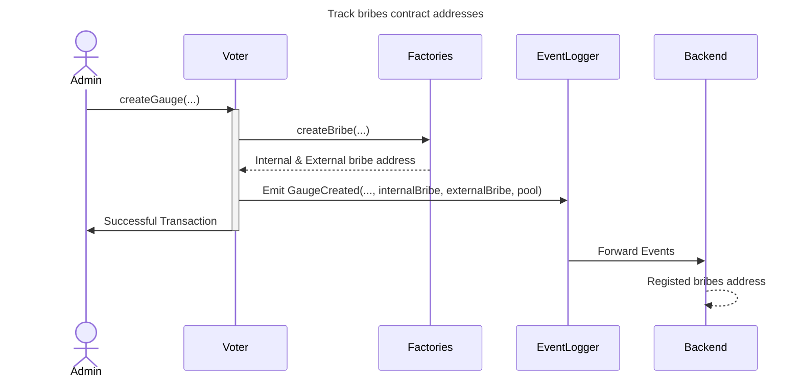
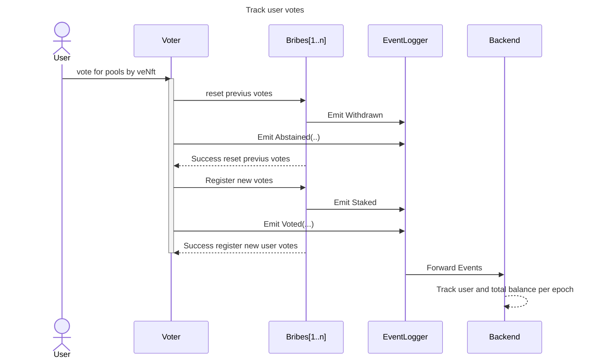
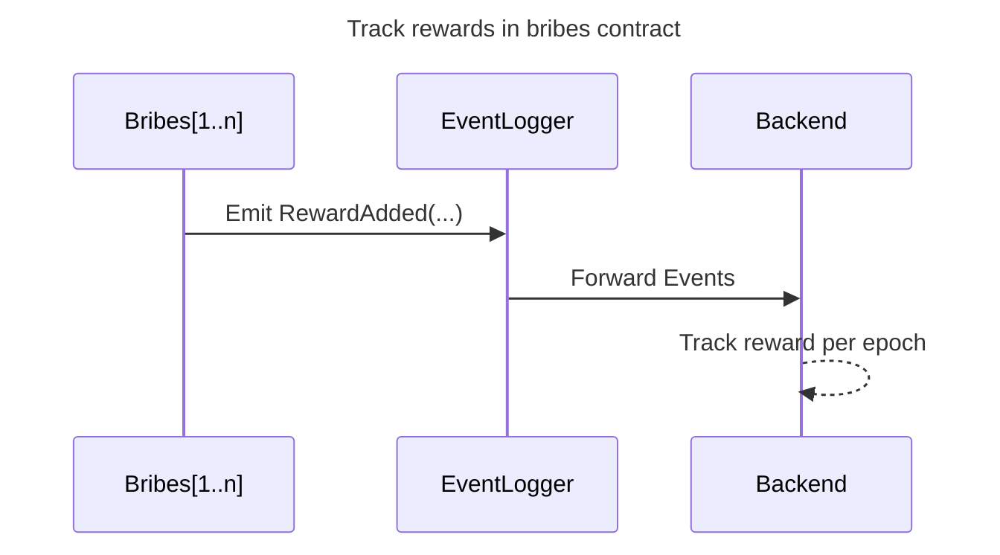

## How to Track Rewards Accrued to a Lock from Bribe Contracts

This document explains how to track the rewards accrued to a lock (veNFT) for a specific epoch by tracing the votes and bribes associated with `BribeUpgradeable` contracts. The rewards come from bribes provided to pools that the user has voted for through the `Voter` and `Gauge` contracts. This guide outlines the steps necessary to track these rewards accurately.

### Key Concepts

- **Lock (veNFT)**: Represents a user's voting power in the protocol, often linked to rewards from voting.
- **Epoch**: A specific time period used for the calculation and distribution of rewards (e.g., one week).
- **Bribe Contracts**: Manages the bribes received and distributes them based on user voting power.

### Step-by-Step Instructions to Track Rewards

To determine the rewards accrued to a user's lock from bribe contracts, follow these steps:

### 1. Track All Bribe Contracts Related to a Gauge (registered in protocol)

To track bribe rewards, you first need to identify all the `BribeUpgradeable` contracts where rewards might be distributed. This involves listening to the `GaugeCreated` event on `Voter` contract, which emits the addresses of the internal and external bribes.

- **Identify Bribe Contracts through Gauge Creation**:
  - The `Voter` contract creates gauges, and each gauge has associated `BribeUpgradeable` contracts.
  - Listen to the **`GaugeCreated`** event in the `Voter` contract to identify new gauges and their associated bribe contracts.

  ```solidity
  event GaugeCreated(address indexed gauge, address creator, address internalBribe, address indexed externalBribe, address indexed pool);
  ```

  - **Parameters**:
    - `gauge`: The address of the created gauge.
    - `internalBribe`: The address of the internal bribe contract.
    - `externalBribe`: The address of the external bribe contract.
    - `pool`: The address of the associated pool.

  By monitoring this event, you can identify all relevant bribe contracts that may hold rewards for a given lock.

### 2. Track User Voting Power in Each Bribe Contract at the End of an Epoch

To determine the user's share of rewards in **each bribe contract**, you need to determine the user's voting power in each contract at the end of an epoch. **Events within an era only change the power of the voice of that era, events in new eras have no effect on the past ones, so from each era the user's balance = 0**

- **Track Voting Events**:
  - Listen to the **`deposit`** and **`withdraw`** events in each `BribeUpgradeable` contract to track changes in a user's voting power.

  ```solidity
  event Staked(uint256 indexed tokenId, uint256 amount);
  event Withdrawn(uint256 indexed tokenId, uint256 amount);
  ```

After each reset of the user's voice, Withdrawn should reset the balance to zero. The may best solution is to track the last Staked event in the era, and if it is not followed by Withdrawn, take the value of the event amount as the user's balance


### 3. Track Rewards Distributed to the Bribe Contract

To determine how much reward has been distributed to a bribe contract, you need to track the reward events and state variables that hold the reward data.

- **Track Reward Events**:
  - Listen to the `RewardAdded` event, which is emitted whenever new rewards are added to a BribeUpgradeable contract.
  ```solidity
  event RewardAdded(address indexed rewardToken, uint256 reward, uint256 startTimestamp);
  ```
   - `startTimestamp`: Indicates the epoch during which the reward was issued. Sum all rewards of the same token within the same epoch to get the total reward for that epoch for locks that voted for pools associated with the bribe contracts.


### 4. Calculate User's Share of the Rewards

Once you have the user's voting power and the total rewards for the epoch, you can calculate the user's share of the rewards.

- `Calculate User's Reward`:
   Perform the following calculations for each reward token distributed in the bribe contract based on the user's balance at the end of the epoch and the total rewards of that token:

   ```
   userBalance / totalBalance * tokenRewardPerEpoch = userRewardInToken
   ```
   Repeat this calculation for each reward token (e.g., token0, token1).


### 5. Convert Rewards to USD Equivalent

After calculating the user's tokens rewards, convert the reward tokens to their USD equivalent at the end of the epoch.


## Diagrams







