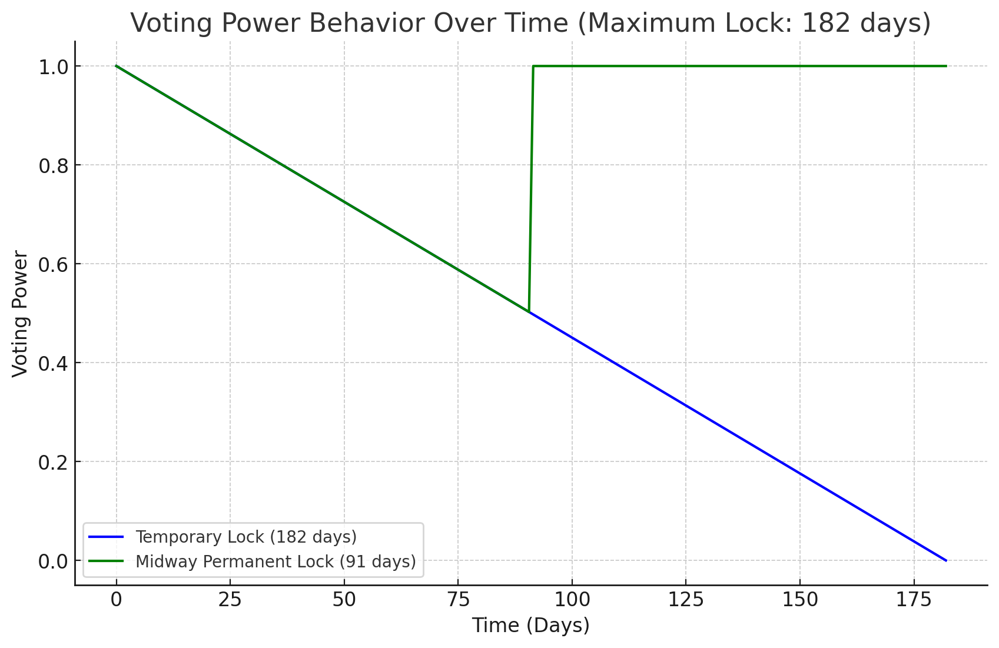
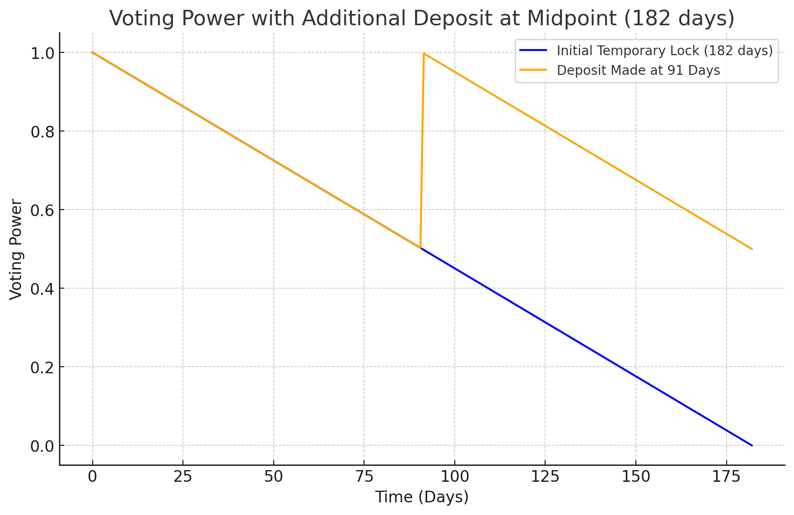
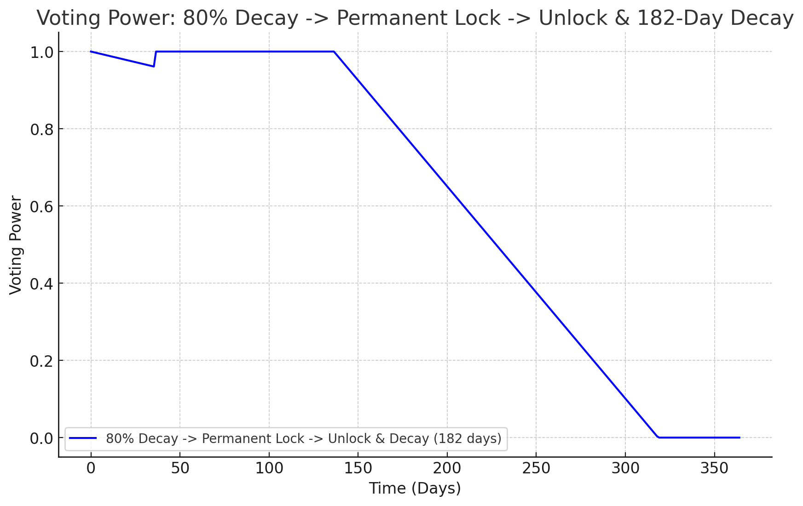

# Voting Power in VotingEscrowUpgradeableV2 with Examples

## How Voting Power is Calculated

In `VotingEscrowUpgradeableV2`, voting power is calculated based on the amount of tokens locked and the duration of the lock. The maximum lock duration in this scenario is **182 days**.

There are different behaviors for voting power based on whether the tokens are temporarily locked, permanently locked, or have mixed behavior (where the lock changes from temporary to permanent).

### Examples of Voting Power Behavior:

1. **Temporary Lock (182 days)**:
    - Voting power decays linearly over time and reaches zero at the end of the lock period.

2. **Permanent Lock at Midpoint (91 days)**:
    - Tokens are locked temporarily, but halfway through the lock period (at 91 days), they are converted to a permanent lock. After this conversion, voting power remains constant.

3. **Gradual Decay with Permanent Lock after 50% Decay**:
    - Voting power decays for the first half of the lock period and then becomes permanent, locking the voting power at the midway decay point.

---

## Voting Power Decay Over Time

The following chart shows how voting power behaves in diff scenario:

Deposit on the same balance like initial on 91 day

---

## Key Points

- **Maximum lock duration**: 182 days.
- **Temporary locking**: Voting power decays linearly over time.
- **Permanent locking**: Voting power remains constant once tokens are permanently locked.
- **Mixed behavior**: Permanent locks can be applied midway through, freezing voting power at a certain level.

In each scenario, the voting power behaves differently based on the type of lock applied.
